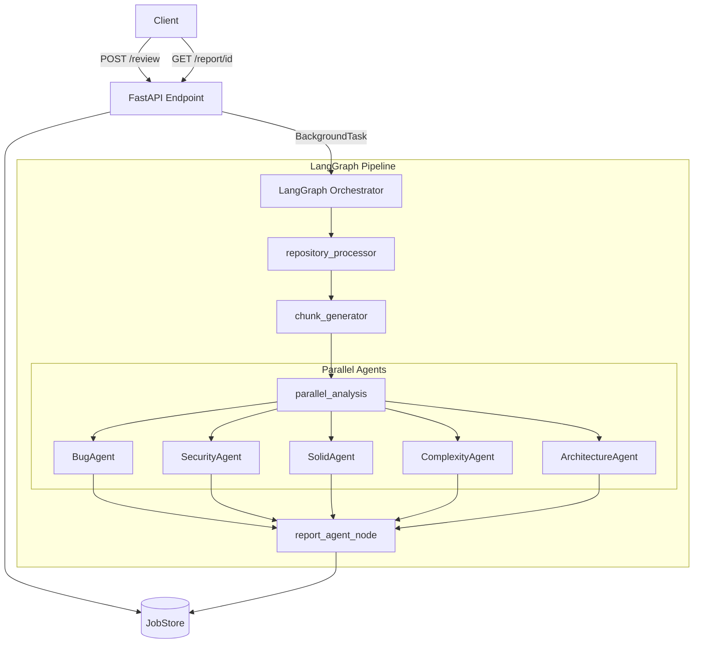

# CodeGuardian AI

**A deterministic, multi-agent static analysis pipeline built on LangGraph and FastAPI to automate code review, architectural auditing, and security scanning.**

[](LICENSE)
[](https://www.python.org/downloads/)
[](https://fastapi.tiangolo.com/)

## 📖 Project Overview
CodeGuardian AI is an async-first code review API orchestrating a multi-agent static analysis workflow via LangGraph. It surfaces bugs, security vulnerabilities, complexity hotspots, and architectural smells using strict AST parsing and deterministic rule-based heuristics.

Designed as a pipeline for CI/CD integrations and automated audits, it evaluates entire repositories and generates comprehensive scored markdown and PDF reports.

## ✨ Features
* **Async API**: FastAPI endpoints with job polling (`/review`, `/status`, `/report`).
* **Workflow Orchestration**: LangGraph state machine orchestrating highly-concurrent, parallel analysis nodes.
* **5 Deterministic Analyzers**: Bug, Security, SOLID, Complexity, and Architecture agents powered by regex, Python AST traversal, Radon metrics, and graph dependency analysis.
* **Comprehensive Reporting**: Automated generation of scored markdown and PDF reports.
* **Resilient Ingestion**: Support for GitHub repository cloning and ZIP uploads with line-preserving file chunking.
* **Data Integrity**: Strict runtime data contracts enforced by Pydantic V2.

## 🏗️ Architecture

### High-Level Workflow


## 💻 Tech Stack
- **API Backend**: FastAPI, Pydantic V2
- **Orchestration**: LangGraph, LangChain
- **Static Analysis**: Python `ast`, Radon (complexity)
- **Embeddings & Indexing**: Sentence-Transformers, FAISS (currently used for index construction only; retrieval disabled in v1)
- **UI**: Streamlit

## 🚀 Installation & Local Setup

1. **Clone the repository**
   ```bash
   git clone https://github.com/kanishkk-gupta/Code-Review-AI-Platform.git
   cd Code-Review-AI-Platform
   ```

2. **Set up virtual environment**
   ```bash
   python -m venv venv
   source venv/bin/activate  # On Windows: venv\Scripts\activate
   pip install -r requirements.txt
   ```

3. **Configure Environment Variables**
   Create a `.env` file in the root directory:
   ```env
   # Example .env
   API_KEY=your_secure_api_key_here
   APP_ENV=development
   ```

## ⚡ Running the Services

### Start the FastAPI Backend
```bash
uvicorn api.main:app --reload --port 8000
```
* Swagger UI available at: `http://localhost:8000/docs`

### Start the Streamlit Dashboard (Experimental)
```bash
streamlit run ui/streamlit_app.py
```

## 🔌 Example API Request

```bash
curl -X 'POST' \
  'http://localhost:8000/review' \
  -H 'X-API-Key: your_secure_api_key_here' \
  -H 'Content-Type: application/json' \
  -d '{
  "source_url": "https://github.com/encode/starlette",
  "config": {
    "include_draft_findings": false
  }
}'
```

## 📊 Benchmarks

### Tested Repositories
* Django
* Flask
* FastAPI
* Pydantic
* Typer
* Click
* Requests

The rule-engine has been benchmarked against these major open-source frameworks. See [docs/BENCHMARKS.md](docs/BENCHMARKS.md) for detailed precision analysis.

## ⚠️ Current Limitations (v1.0)
CodeGuardian AI v1.0 operates as a **deterministic, rule-based engine**.
- **No LLM Integration**: LLM-powered confirmation layers are explicitly stubbed out to prioritize zero-cost, deterministic analysis.
- **No RAG Retrieval**: While FAISS vector embeddings are constructed during file ingestion, semantic querying is not executed during agent evaluation.
- **False Positives**: Without an LLM synthesis step, regex-based analyzers may generate noise on test suites and certain file types (e.g., Javascript division operators).

## 🗺️ Roadmap
**Version 2.0 Focus:**
- **LLM Synthesis & Verification**: Wire OpenAI/Ollama clients to enable AI-confirmation, drastically reducing false positives on regex-based hits.
- **RAG Context Enrichment**: Query the FAISS index to provide agents with deep, cross-file semantic context.
- **Aggressive Test-File Filtering**: Improve heuristics to silence vulnerability and complexity noise generated by unit test suites.
- **Official Web Frontend**: Complete the end-to-end Streamlit web dashboard.

## 📸 Screenshots
*(Coming soon: Dashboard and Report visualizations)*

## 🤝 Contributing
Contributions are welcome! Please check out our issues and submit pull requests.

## 📄 License
This project is licensed under the MIT License - see the [LICENSE](LICENSE) file for details.
