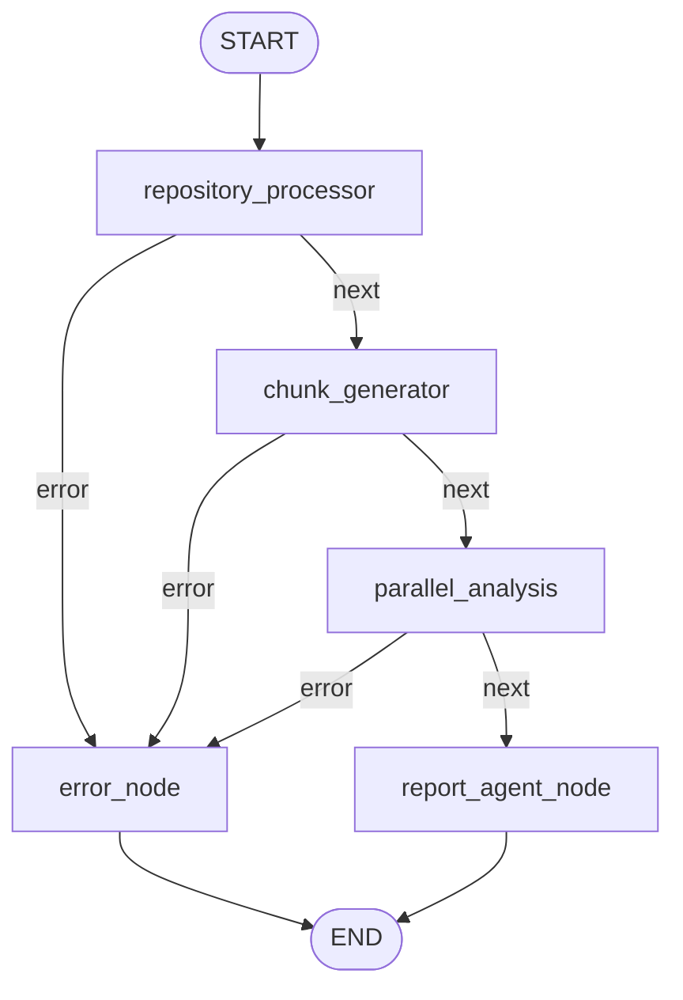

# CodeGuardian AI — Final System Audit

**Audit date:** 2026-06-12  
**Scope:** Full end-to-end read-only inspection of `codeguardian-ai/`  
**Method:** Source review, test inventory, workflow tracing, benchmark evidence from prior runs  
**Constraint:** No code changes; evidence-backed conclusions only.

---

## Executive Summary

CodeGuardian AI is a **functioning deterministic static-analysis platform** with a **working FastAPI + LangGraph orchestration path** for rule-based review. Its **production API can accept jobs, run analysis, and return reports** when dependencies (Git, FAISS, sentence-transformers) are available.

However, several marketed capabilities are **not end-to-end operational**:

| Capability | Status |
|------------|--------|
| Rule-based analysis (5 agents) | **FULLY IMPLEMENTED** (offline mode) |
| FastAPI job lifecycle | **FULLY IMPLEMENTED** |
| LangGraph workflow (`graph/workflow.py`) | **FULLY IMPLEMENTED** |
| Legacy graph nodes (`graph/nodes/*`) | **STUBBED / DEAD** |
| Embeddings generation | **IMPLEMENTED** in workflow |
| FAISS index build | **IMPLEMENTED** in workflow |
| FAISS retrieval / RAG consumption | **UNUSED** in active pipeline |
| LLM analysis (OpenAI/Ollama) | **STUBBED** (`NotImplementedError`) |
| Streamlit UI | **PARTIALLY IMPLEMENTED** (shell only) |
| Enrich node / context retrieval | **NOT PRESENT** in active graph |

**Honest RAG answer: NO** — vectors are built but never retrieved or fed to agents/findings in the live workflow.

**Honest LLM answer: NO** — `get_llm_client()` raises `NotImplementedError`; agents default to `llm_confirm=True` but fail gracefully or skip when LLM unavailable.

---

## Section 1 — API Layer

**Subsystem status: FULLY IMPLEMENTED** (core routes); **PARTIALLY IMPLEMENTED** (full E2E validation)

| Path | Purpose | Status | Tested? |
|------|---------|--------|---------|
| `GET /` | Service metadata redirect | FULLY IMPLEMENTED | No |
| `GET /health` | Liveness/readiness; checks embedding model registry | FULLY IMPLEMENTED | No |
| `GET /docs` | Swagger UI | FULLY IMPLEMENTED (FastAPI auto) | No |
| `GET /redoc` | ReDoc | FULLY IMPLEMENTED | No |
| `GET /openapi.json` | OpenAPI schema | FULLY IMPLEMENTED | No |
| `POST /review` | Submit repo URL or ZIP; returns 202 + job_id | FULLY IMPLEMENTED | **Yes** (integration) |
| `GET /status/{job_id}` | Poll job progress/result | FULLY IMPLEMENTED | No |
| `GET /report/{job_id}` | Fetch completed ReviewResult | FULLY IMPLEMENTED | No |

### Evidence

- App factory: `api/main.py` — CORS, request ID middleware, logging middleware, global exception handlers, lifespan warmup.
- Review pipeline dispatched via `BackgroundTasks` → `graph.workflow.get_workflow().ainvoke()` (`api/routes/review.py:69-115`).
- Auth: `api/dependencies.py:verify_api_key` — `X-API-Key` header compared to `settings.api_key`; returns 401 on mismatch.
- Request validation: Pydantic `ReviewRequest` / `ReviewConfig` via FastAPI.
- Job store: in-memory `JobStore` with PENDING → RUNNING → COMPLETED/FAILED lifecycle.
- Error handling: global 500 handler, ValueError → 400, route-level 404/409.

### Gaps

- No integration tests for `/health`, `/status`, `/report`, or full background pipeline completion.
- Progress syncer in `_run_review_pipeline` polls every 3s but does not receive live intermediate state from LangGraph (only final output) — progress jumps are coarse.
- `ReviewState` in schema still documents `ingest_node` / `analyze_node` field ownership; actual graph uses different node names.

---

## Section 2 — Workflow

**Subsystem status: FULLY IMPLEMENTED** (`graph/workflow.py`); **STUBBED** (`graph/nodes/*`)

### Active graph topology (reachable)

### Conditional routing

- Function `_route(state)` (`graph/workflow.py:94-99`): if `state["error"]` → `"error"`, else `"next"`.
- Applied after: `repository_processor`, `chunk_generator`, `parallel_analysis`.

### State schema

- Canonical: `schemas.ReviewState` + `ReviewConfig` (re-exported in `graph/state.py`).
- Runtime graph uses `StateGraph(dict)` — plain dict, not typed `ReviewState` model.
- Key fields: `job_id`, `source_url`, `source_zip_b64`, `config`, `metadata`, `chunks`, `faiss_index`, five `*_findings` lists, `result`, `progress`, `error`, transient `_file_tuples`.

### Node inventory

| Node | Implemented? | Executed in prod path? | Reachable? | Notes |
|------|--------------|------------------------|------------|-------|
| `repository_processor` | Yes | Yes | Yes | `tools.file_parser.parse_source` |
| `chunk_generator` | Yes | Yes | Yes | chunk + embed + FAISS build |
| `parallel_analysis` | Yes | Yes | Yes | 5 agents via `asyncio.gather` |
| `report_agent_node` | Yes | Yes | Yes | `ReportAgent.run()` |
| `error_node` | Yes | Yes (on error) | Yes | Terminal |
| `ingest_node` | Stub | **No** | **Dead** | `NotImplementedError` |
| `analyze_node` | Stub | **No** | **Dead** | `NotImplementedError` |
| `enrich_node` | Stub | **No** | **Dead** | `NotImplementedError` |
| `compile_node` | Stub | **No** | **Dead** | `NotImplementedError` |

### Evidence

- `graph/graph.py` delegates entirely to `graph.workflow.get_workflow()` — shim only.
- README architecture diagram (`ingest → analyze → enrich → compile`) **does not match** the active workflow.
- `graph/nodes/*.py` contain Phase 2 TODOs and raise `NotImplementedError`.

---

## Section 3 — Repository Ingestion

**Overall status: PASS** (with caveats on path filtering at ingest)

| Component | Status | Evidence |
|-----------|--------|----------|
| GitHub cloning | FULLY IMPLEMENTED | `tools/github_tools.fetch_repo`, `tools/file_parser._parse_git_url` |
| ZIP uploads | FULLY IMPLEMENTED | `tools/file_parser._parse_zip` with zip-slip guard |
| Parser | FULLY IMPLEMENTED | `tools/file_parser.parse_source` — extension, size, binary filters |
| Chunker | FULLY IMPLEMENTED | `tools/chunker.chunk_file` — fixed line windows |

### Verification checklist

| Check | Result | Evidence |
|-------|--------|----------|
| Chunks preserved correctly | **PASS** | `tests/unit/test_chunker.py`; `CodeChunk` `str_strip_whitespace=False` in `schemas.py` |
| Line numbers preserved | **PASS** | `test_chunker.py::test_chunk_line_numbers_are_correct` |
| Indentation preserved | **PASS** | `tests/unit/test_complexity_file_aggregation.py::test_indented_line_at_chunk_boundary_preserved` |
| File reconstruction works | **PASS** | `test_reconstructed_file_matches_original_and_parses`; `aggregate_files_from_chunks` |

### Caveats

- Ingest does **not** filter `tests/`, `docs/`, `static/` at source — filtering is agent-side via `is_non_production_path()`.
- `list_source_files()` includes JS/TS/Java/C++ by default (`GITHUB_TOOL_LANGUAGES`).
- Max 512 KB/file, 5000 files/repo.

---

## Section 4 — Analysis Agents

### Summary table

| Agent | Techniques | Production filter | Non-Python filter | Benchmark | Maturity /10 |
|-------|------------|-------------------|-------------------|-----------|--------------|
| **BugAgent** | Regex + AST (BUG-001/002/003/010/011/020/021); optional LLM | Yes (`is_non_production_path`) | AST Python-only; regex runs on all langs for non-AST rules | Yes (7 repos) | **7** |
| **SecurityAgent** | Regex + AST taint (SEC-010/030/040/050/070); optional LLM | Yes | AST Python-only; **regex Python-only** (recent fix) | Yes | **7** |
| **ComplexityAgent** | Radon CC + AST nesting/cognitive; file aggregation | Yes | Python metrics only; generic returns `[]` | Yes | **8** |
| **ArchitectureAgent** | Import graph, SCC cycles, composite god-module score; optional LLM | Yes (`_build_file_summaries`) | Multi-lang import extraction; graph on production files | Yes | **6** |
| **SolidAgent** | Python AST heuristics; optional LLM | Heuristics: Yes; LLM: Yes (recent fix) | Heuristics Python-only | Yes | **5** |

### Per-agent detail

#### BugAgent — `agents/bug_agent.py`
- **Detection:** AST (`agents/_ast_analysis.py`) for null deref, optional guards, division/modulo, loops; regex for resource leaks, dead code, etc.
- **Production filtering:** `is_non_production_path()` in `_scan_chunks()`; extended patterns in `_scan_utils.py` (`__tests__/`, `unit_tests/`, `static/`, etc.).
- **Non-Python:** BUG-010/011 AST-only on Python full files; regex still runs on non-Python for BUG-030+ rules.
- **Benchmark:** `scripts/benchmark_repos.py` with `llm_confirm=False`.
- **Limitations:** BUG-003 guards incomplete for subscript/call-only; one hit per rule per file; LLM path broken.

#### SecurityAgent — `agents/security_agent.py`
- **Detection:** Regex secrets/injection; AST lightweight taint for SEC-010/030/040/050/070.
- **Production filtering:** Yes; secrets suppressed in test/docs/example.
- **Non-Python:** Regex loop skips non-Python (line 554-555).
- **Limitations:** Intraprocedural taint only; SEC-011/020 still regex; placeholder heuristics miss novel patterns.

#### ComplexityAgent — `agents/complexity_agent.py`
- **Detection:** Radon cyclomatic complexity, AST nesting, cognitive approximation, LOC thresholds.
- **Thresholds:** CC ≥40 Critical, ≥25 High, ≥15 Medium, &lt;15 ignore; `min_severity=HIGH` default in benchmarks.
- **Limitations:** Large repos (Django) produce high finding counts; non-Python files produce no metrics.

#### ArchitectureAgent — `agents/architecture_agent.py`
- **Detection:** Graph analysis — god-module composite score, cycles, fan-out, layer naming heuristics, big-ball-of-mud.
- **Production filtering:** Yes in `_build_file_summaries`.
- **Limitations:** Import graph is name-prefix heuristic; layer violations depend on directory keywords; framework entrypoint exemption may miss edge cases.

#### SolidAgent — `agents/solid_agent.py`
- **Detection:** AST heuristics (SRP method count, OCP isinstance branches, ISP abstract methods, DIP concrete deps).
- **Production filtering:** Heuristics filtered; `_llm_analyze` now filtered.
- **Limitations:** Partial-chunk AST on heuristics (not file-aggregated); high false-positive rate on mature codebases; LLM broken.

### Workflow agent invocation

`graph/workflow.py:388-411` calls agents with **default `llm_confirm=True`** (Bug, Security, Solid) and **`llm_synthesize=True`** (Architecture). Offline benchmarks explicitly pass `llm_confirm=False`.

---

## Section 5 — Precision Audit

### Benchmark repositories used

`scripts/benchmark_repos.py` runs against:

1. requests  
2. flask  
3. django  
4. fastapi  
5. pydantic  
6. click  
7. typer  

Agents: Bug, Security, Complexity, Architecture, Solid — all with `llm_confirm=False` / graph-only for architecture.

### Last known benchmark totals (post precision + path-filter fixes)

| Repo | Total findings | Notes |
|------|----------------|-------|
| requests | 20 | Mostly complexity |
| flask | 14 | |
| django | 452 | 285 complexity — scale noise |
| fastapi | 84 | |
| pydantic | 148 | |
| click | 33 | |
| typer | 48 | |
| **Validation issues** | **0** | Automated FP checks in benchmark script |

### Known false positives (documented)

| Area | Examples | Cause |
|------|----------|-------|
| BUG-003 | Unguarded optional in complex guard patterns | Limited guard AST (subscript/call paths) |
| SEC-040 | `requests.get(url)` with non-tainted `url` variable name | Name-heuristic taint |
| Architecture | Layer violations from directory naming | Keyword-based layer ranks |
| SOLID | DIP on `BytesIO`, test-like patterns | Heuristic concrete-type detection |
| Complexity | HIGH count on large frameworks | Inherent high CC in framework code |
| Path leaks (residual) | `js_tests/`, `testproject/` | Not in `classify_file_role` patterns |

### Known false negatives (documented)

| Area | Gap |
|------|-----|
| SEC-010 | SQLi without taint-shaped variable names |
| SEC-050 | `pickle.loads` on trusted-looking identifiers |
| BUG-010 | Runtime division with non-numeric variable names filtered intentionally |
| Cross-file taint | No interprocedural analysis |
| Non-Python security | Regex disabled for JS/Java in SecurityAgent |

### Precision estimates (reasoning-based, not formal ground truth)

| Dimension | Estimate | Reasoning |
|-----------|----------|-----------|
| Bug precision | **~75–85%** | AST rules strong for BUG-001/002; BUG-003/010 improved; regex tail remains |
| Security precision | **~70–80%** | Taint cut SEC-040/050 FPs; secrets still regex-heavy; test suppression works |
| Complexity precision | **~85–90%** | Radon-backed numeric metrics; threshold tuning reduces noise; Django scale inflates volume |
| Architecture precision | **~60–70%** | Graph metrics real but naming heuristics produce debatable smells |
| SOLID precision | **~55–65%** | AST heuristics coarse; chunk-level analysis misses file context |

These are **engineering estimates** from benchmark behavior and rule design — no labeled ground-truth dataset exists in the repo.

---

## Section 6 — Embeddings

**Status: IMPLEMENTED in workflow; PARTIALLY WIRED to downstream consumers**

| Item | Detail |
|------|--------|
| Model | `sentence-transformers/all-MiniLM-L6-v2` |
| Dimensions | **384** (`rag/embeddings.py:71`, `rag/vector_store.py:34`) |
| Generation | `chunk_generator` calls `load_embedding_model().embed_batch_numpy()` (`graph/workflow.py:258-265`) |
| Storage | Attached to `CodeChunk.embedding` (float32 ndarray); stripped before JSON serialization |
| Tested? | **Yes** — `tests/unit/test_rag_embeddings.py` (mocked ST); workflow warmup in `api/main.py` |
| Used by agents? | **No** — agents operate on text chunks only |
| Used by RAG? | **No** — retrieval not invoked in active graph |

---

## Section 7 — FAISS

**Status: PARTIALLY WIRED**

| Stage | Status | Evidence |
|-------|--------|----------|
| Index creation | **IMPLEMENTED** | `rag/vector_store.build_index()` in `chunk_generator` |
| Index population | **IMPLEMENTED** | Vectors from embedded chunks added to `IndexFlatL2` |
| Retrieval | **IMPLEMENTED but UNUSED** | No call in `graph/workflow.py` after build |
| Persistence | **NOT USED** in workflow | In-memory per job; cleared in `report_agent_node` |
| Dual implementations | **YES** | `rag/vector_store.py` (workflow) vs `rag/faiss_store.py` (retriever tests) |

Vectors **are inserted** during `chunk_generator`. Queries **are not executed** in the production graph. `faiss_index` is set to `None` after report generation (`graph/workflow.py:560`).

Tests: `tests/unit/test_faiss_store.py` exists (some failures reported historically in conversation).

---

## Section 8 — Retriever

**Status: WIRED BUT UNUSED**

| Item | Detail |
|------|--------|
| Module | `rag/retriever.py` — `retrieve_chunks`, `ChunkRetriever`, `build_chunk_map` |
| Vector search | Delegates to `rag/faiss_store.similarity_search` |
| Called in workflow? | **No** |
| Called in agents? | **No** |
| Referenced by | `rag/__init__.py`, schema field descriptions, **stub** `enrich_node` comments |
| Tested? | **Yes** — `tests/unit/test_retriever.py` (484 lines, mocked FAISS) |

**Dead path:** `enrich_node` would call retriever but is not in the compiled graph.

---

## Section 9 — RAG Pipeline

### Expected vs actual flow

| Step | Expected | Actual in `graph/workflow.py` |
|------|----------|-------------------------------|
| Repository | ✓ | `repository_processor` |
| Chunking | ✓ | `chunk_generator` via `tools.chunker` |
| Embedding | ✓ | `load_embedding_model().embed_batch_numpy` |
| FAISS | ✓ build only | `build_index()` — **no search** |
| Retrieval | ✗ | **Missing** |
| Context enrichment | ✗ | `enrich_node` stubbed, not in graph |
| Agent consumption | ✗ | Agents use raw chunks; `related_chunk_ids` never populated |

### Implemented pieces
- Chunking, embedding, FAISS build, retriever module (standalone), enrich_node spec (stub).

### Missing / dead pieces
- `enrich_node` in graph
- Retriever invocation
- Passing retrieved context to LLM prompts
- `similarity_top_k` in `ReviewConfig` is **unused** in active workflow

### Answer

**Can this project honestly claim to have a working RAG pipeline today?**

## **NO**

Embeddings and a FAISS index are built per job, but **no retrieval step runs** and **no agent consumes semantic neighbors**. This is **embedding + index construction only**, not retrieval-augmented generation.

---

## Section 10 — LLM Integration

**Status: STUBBED**

| Component | Status | Evidence |
|-----------|--------|----------|
| OpenAI | **STUBBED** | `services/llm_client.py:68` — `raise NotImplementedError` |
| Ollama | **STUBBED** | `services/llm_client.py:78-79` — commented TODO |
| LangChain chains | **WIRED but broken** | Agents call `_build_chain()` → `get_llm_client()` |
| Prompts | **PRESENT** | `prompts/` templates loaded by agents |
| Report LLM summary | **WIRED with fallback** | `_llm_summary()` catches exception → template fallback |

### Workflow defaults (problematic)

- `BugAgent.run(chunks)` — `llm_confirm=True` default
- `SecurityAgent.run(chunks)` — `llm_confirm=True` default
- `SolidAgent.run(chunks)` — `llm_confirm=True` default
- `ArchitectureAgent.analyse_repository(..., llm_synthesize=True)` default
- `ReportAgent.run(..., llm_summary=True)` default

Agents generally **fall back to rule-only findings** when LLM chain build fails, but Architecture/Report attempt LLM paths that log warnings.

### Answer

**Can the project currently perform LLM-powered analysis?**

## **NO**

No configured provider returns a working `BaseChatModel`. Rule-based analysis works; LLM confirmation, synthesis, and executive summaries use **deterministic fallbacks** when LLM calls fail.

---

## Section 11 — Streamlit

**Status: PARTIALLY IMPLEMENTED**

| Feature | Status | Evidence |
|---------|--------|----------|
| App shell | Present | `ui/app.py`, `ui/streamlit_app.py` |
| Submit page | **STUB** | `ui/pages/01_submit.py:66-71` — "API integration coming in Phase 2" |
| Status polling | **STUB** | `ui/pages/02_status.py:24-31` — placeholder JSON |
| Report rendering | **STUB** | `ui/pages/03_report.py:34-35` — placeholder |
| API client | **IMPLEMENTED** | `ui/utils/api_client.py` — full HTTP client, unused by pages |
| Tested? | **No** | No `tests/ui/` or Streamlit tests found |

The UI **cannot** complete an end-to-end review without manual API calls.

---

## Section 12 — Reports

**Status: FULLY IMPLEMENTED** (via workflow); **not benchmark-unit-tested**

| Component | Status | Evidence |
|-----------|--------|----------|
| Report generation | FULLY IMPLEMENTED | `agents/report_agent.py`, `reports/generator.py` |
| Markdown | FULLY IMPLEMENTED | Jinja2 template → `.md` file |
| PDF | PARTIAL | WeasyPrint optional; `pdf_path` may be `None` |
| Scoring | FULLY IMPLEMENTED | Weighted category penalties in `ReportAgent` |
| Summaries | PARTIAL | Template fallback works; LLM summary fails silently |
| Benchmark tested? | **Indirectly** — via `report_agent_node` in workflow benchmarks, no `test_report_agent.py` |

---

## Section 13 — Resume Claim Validation

Claims evaluated against README and typical project positioning:

| Claim | Verdict | Justification |
|-------|---------|---------------|
| "Production-grade AI-powered code review platform" | **PARTIALLY TRUE** | Working API + agents + workflow; missing LLM, RAG, UI integration |
| "Built a RAG pipeline using FAISS" | **MISLEADING** | FAISS index built; retrieval never wired to analysis |
| "LangGraph multi-agent orchestration" | **MOSTLY TRUE** | `graph/workflow.py` runs 5 agents in parallel; legacy nodes dead |
| "FastAPI REST API with async job lifecycle" | **TRUE** | POST/GET routes, background tasks, job store |
| "Sentence-transformer embeddings" | **MOSTLY TRUE** | Generated in workflow; not consumed downstream |
| "OWASP Top 10 / CWE security analysis" | **PARTIALLY TRUE** | Subset via regex + AST taint; not comprehensive SAST |
| "Streamlit dashboard" | **MISLEADING** | UI exists but API integration stubbed |
| "Hybrid LLM + rule-based analysis" | **PARTIALLY TRUE** | Hybrid architecture intended; LLM non-functional |
| "PDF report generation" | **MOSTLY TRUE** | Implemented with optional WeasyPrint dependency |
| "Semantic code search / context enrichment" | **FALSE** | Retriever unused; `related_chunk_ids` never set in workflow |
| "Analyzes bugs, SOLID, architecture, security, complexity" | **TRUE** | All five agents produce findings in offline mode |
| "GitHub + ZIP ingestion" | **TRUE** | `tools/file_parser.py` fully implemented |

---

## Section 14 — Production Readiness Scores

| Subsystem | Score /10 | Notes |
|-----------|-----------|-------|
| API layer | 7 | Solid routes; thin integration test coverage |
| Workflow orchestration | 7 | Active path works; docs mismatch legacy nodes |
| Repository ingestion | 8 | Reliable; no ingest-level path filtering |
| Analysis agents (rules) | 7 | Mature offline; precision improving |
| Analysis agents (LLM) | 1 | Not implemented |
| Embeddings | 6 | Built but unused downstream |
| FAISS | 4 | Built, never queried in prod |
| RAG / Retriever | 2 | Code exists; not in graph |
| Streamlit UI | 3 | Shell only |
| Reports | 7 | Works in workflow |
| Test suite | 6 | Good unit coverage; gaps on E2E/API/RAG |
| Documentation accuracy | 4 | README topology outdated |

### Overall scores

| Metric | Score |
|--------|-------|
| **Overall Engineering Score** | **6.0 / 10** |
| **Overall Accuracy Score** | **6.5 / 10** (rule-only, post-precision pass) |
| **Overall Resume Strength** | **4.5 / 10** (overstates RAG/LLM/UI) |
| **Overall Production Readiness** | **5.0 / 10** (viable offline SAST API; not full AI platform) |

---

## Section 15 — Recommended Next Steps (by ROI)

| Rank | Item | Effort | Impact |
|------|------|--------|--------|
| 1 | **Wire `llm_confirm=False` / `llm_synthesize=False` defaults in `parallel_analysis`** | Low | High — stops silent LLM failure attempts in production |
| 2 | **Implement `get_llm_client()` (OpenAI or Ollama)** | Medium | High — unlocks hybrid analysis as designed |
| 3 | **Add `enrich_node` to graph OR remove FAISS build** | Medium | High — either complete RAG or stop wasted embed cost |
| 4 | **Wire `ChunkRetriever` into findings (`related_chunk_ids`)** | Medium | High — makes RAG claim truthful |
| 5 | **Unify FAISS stacks** (`vector_store` vs `faiss_store`) | Medium | Medium — reduces maintenance confusion |
| 6 | **Connect Streamlit pages to `APIClient`** | Low | Medium — completes demo UX |
| 7 | **Ingest-level production path filter** | Low | Medium — defense in depth |
| 8 | **E2E integration test: POST /review → COMPLETED** | Medium | High — production confidence |
| 9 | **BugAgent non-Python regex gate** (match SecurityAgent) | Low | Medium — precision |
| 10 | **SOLID file-level aggregation** | Medium | Medium — precision |
| 11 | **Labeled precision benchmark dataset** | High | High — measurable accuracy |
| 12 | **Report agent unit tests** | Low | Low-Medium |

---

## Appendix A — Test Inventory Summary

| Area | Test files | Notes |
|------|------------|-------|
| AST analysis | `test_ast_analysis.py` | 35+ cases |
| Agents | `test_bug_agent.py`, `test_security_agent.py`, `test_solid_agent.py`, `test_architecture_agent.py`, `test_complexity_agent.py` | |
| Path filtering | `test_scan_utils.py` | Recent audit fixes |
| Chunking / reconstruction | `test_chunker.py`, `test_complexity_file_aggregation.py` | PASS evidence |
| RAG embeddings | `test_rag_embeddings.py` | Mocked |
| Retriever | `test_retriever.py` | Mocked; module unused in workflow |
| FAISS store | `test_faiss_store.py` | Separate from workflow vector_store |
| API integration | `test_review_endpoint.py` | Submit + auth only |
| Benchmark script | `scripts/benchmark_repos.py` | Manual/CI offline validation |

---

## Appendix B — Critical Code References

| Finding | File:line |
|---------|-----------|
| Active workflow graph | `graph/workflow.py:591-652` |
| Stub ingest node | `graph/nodes/ingest_node.py:70` |
| Stub enrich node | `graph/nodes/enrich_node.py:66` |
| LLM stub | `services/llm_client.py:68-79` |
| FAISS build (no search after) | `graph/workflow.py:274-297` |
| Retriever unused | No imports in `graph/workflow.py` |
| Streamlit API stub | `ui/pages/01_submit.py:66-71` |
| Embeddings warmup | `api/main.py:106-130` |

---

*End of audit. No code was modified during this inspection.*
